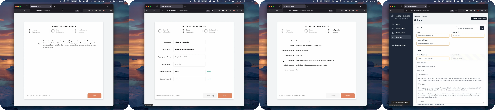
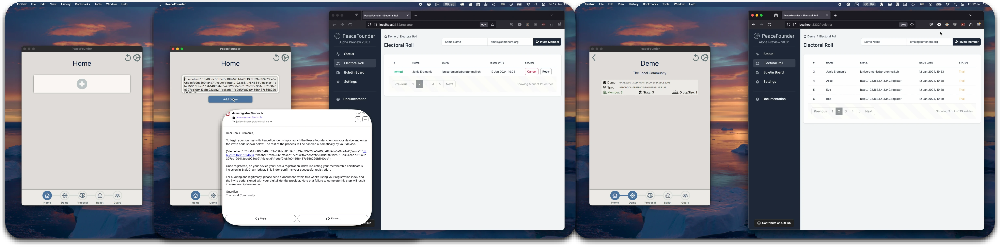
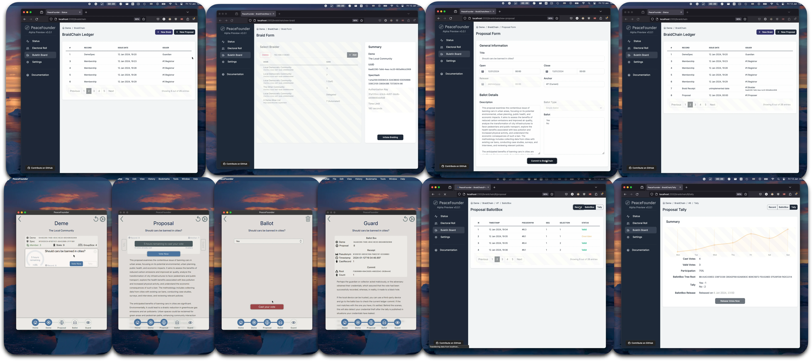
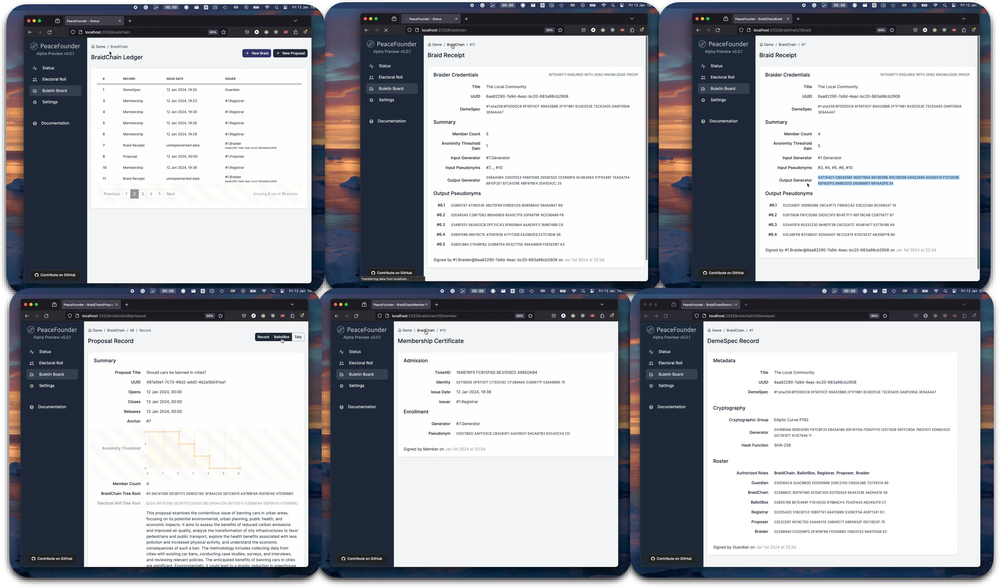

# PeaceFounderAdmin
## System Setup



The first step to begin using the PeaceFounder e-voting system is to host it, which is a straightforward process on Linux servers. Begin by downloading the snap package with the command below, and remember to change the architecture to `arm64` if necessary:

```
curl -LOJ https://github.com/PeaceFounder/PeaceFounderAdmin/releases/download/v0.0.1/peacefounder-server-0.0.1-x64.snap
```

Next, proceed to install the package:

```
snap install --devmode peacefounder-server-0.0.1-x64.snap
```

This installation process automatically handles the compilation and configures the system to start automatically with systemd.

The admin panel, accessible at `http://127.0.0.1:3221`, is hosted locally and is not directly accessible from external networks. To access the admin panel remotely, use SSH to forward the local host port:

```
ssh -L 2332:127.0.0.1:3221 user@192.168.1.16
```

This trick does a secure authentification to the server and is free from PKI network trust assumptions.

The admin panel start with a setup wizard, guiding you to select a cryptographic group, choose a hash function, and generate keys. The server generates the guardian key, which is then encrypted with the provided password and stored in the deme record (a feature currently not implemented). Alternatively, you can use the advanced configurator. This option allows for local creation and signing of the deme record, with the option to encrypt the guardian key on the record (also yet to be implemented). The configurator also facilitates server migration, allowing you to input an existing tarball of braidchain records. The deme record is then appended as the last record, enabling continuity (this feature is also pending implementation).

Once the wizard is complete, the PeaceFounder server becomes active at `http://0.0.0.0:4585`. This is the public access point for clients and exposes the REST API. Further configurations, such as setting up an SMTP server to send invitations to prospective members, are done in the *Settings* panel. Here, you also need to specify an address through which clients can connect to the server. This could be a local address, a public IP, or a DNS pointing to the PeaceFounder REST API.

It's important to note that configuring the system doesn't require a TLS certificate for security, as all replies are signed with braidchain and ballotbox tree root commits. Using TLS can be detrimental as it might lower the threshold for making the system vulnerable to DDOS attacks since TLS session resumption has to be disabled to maintain voter anonymity. Each session would require a new key exchange, relying on a relatively costly group operation. Nevertheless, adding TLS currently wouldn't incur additional costs, as HTTP request processing performance is currently not optimised. Furthermore, the PeaceFounder client functions smoothly, even when the server is configured behind NGINX.

## Member Registration



The process of member registration is conducted via email, through which a unique token is dispatched to the user. Unlike JWT tokens, which are typically incorporated into the header of a TLS connection, the token in this system serves a different purpose. It is utilized as a key in the format `HMAC(body|timestamp, token)` to authenticate requests. To enable the server to identify the origin of the request, a `tokenid=Hash(token)` is included in the header (currently `ticketid` is used but will be made obselete shortly).

When invite is entered into the PeaceFounder client a following steps are performed : 

- The device will retrieve deme specification parameters from provided address which will be compared with hash in the invite;
- The cryptographic parameters will be initialised and a new key pair generated;
- The public key will be authetificated with HMAC using the invite tooken and will be sent to the deme server which shall return the public key signed by the registrar which whe shall reffer as admission certificate;
- In the last step, the device retrieves the current braidchain generator and computes its pseudonym. This, together with the admission certificate, is signed by the member's private key, which consists of a member certificate. The member certificate is sent to the braidchain until History Tree inclusion proof is received, concluding the process. If the generator has changed, a new pseudonym is recomputed.

To guarantee the auditability of the electoral roll, the process involves members signing the received invitations and their corresponding membership certificate record index with a widely trusted digital identity and returning the document to the guardian. This method is robust and effective; the invitation includes a 'demespec', ensuring that client has securely interacted with the claimed entity and had used correct cryptographic parameters. Additionally, the member index acts as a confirmation of successful registration. Such a mechanism renders this e-voting system universally adaptable, making it a viable option globally in regions where any form of digital identity infrastructure is in place.

## Voting



The registration of members is followed by the generation of a braid. To boost anonymity, several braids can chained together in sequence. This technique raises the anonymity threshold - the least number of entities required to be breached to associate a member's certificate with their voting pseudonym. Currently, the system supports only self-braiding, setting the maximum anonymity threshold at one. Future updates aim to enable braiding between different demes, which could be either fictional entities created for specific votes or real communities worldwide. The integrity of the final braid receipt is verified using Zero-Knowledge Proofs (ZKPs) and recorded in the braidchain.

To initiate voting, the guardian sets up a new proposal. This proposal includes key details such as opening and closing times, title, description, ballot, and an anchor. The anchor is essentially the index of a braid, whose generator and pseudonyms are utilized for the vote. Members registered after the braid’s creation are not included in that particular vote. However, continuous member registration and the ability to self-braid should minimize such exclusions. The anchor also facilitates linking multiple proposals, allowing fluid voting situations where members can alter their votes at predetermined times during a representative’s term.

As voting progresses, each vote is logged in the ballot box ledger, displaying the vote cast index, timestamp, sequence number, and vote status. Voters receive a receipt including the timestamp and cast index as a tracking number, which enables them to locate their vote on the bulletin board. The pseudonym links all votes cast from a single device. Plans are underway to introduce an additional token for verifying the vote’s authenticity and a public bulletin board hosted as a static webpage. This will allow voters to ensure their vote is cast as intended and counted accurately.

## BraidChain Ledger



The BraidChain and BallotBox ledgers together create publicly available proof of election integrity. The BallotBox ledger is straightforward, containing votes signed with the voter's pseudonym without altering the state of the ballot box. In contrast, the BraidChain ledger is more complex, and every record changes the system state. Auditors can run audit commands on records stored in the disk (in development) that require no deep understanding of the underlying data structure. However, in cases where issues arise, having a reference point to communicate about these issues effectively is beneficial.

Each record in the BraidChain ledger is authenticated by an issuer's digital signature. To be included, the issuer's record must possess the necessary authorisation, with corresponding public keys detailed in the DemeSpec record, particularly in the roster section. Should there be a need to change a party's key, a revised DemeSpec record is issued, authenticated with the Guardian's private key. It's crucial to secure this key diligently to prevent adversaries from assuming authority and hijacking the election process, which could disrupt availability and create an inconsistent state for participants, leading to the generation of *blame proofs*. In events where the Guardian's key is compromised, it would necessitate the re-establishment of the deme from scratch. Looking ahead, a potential improvement could involve requiring multiple parties to sign off on the DemeSpec record for it to be valid, thus reducing the likelihood of such breaches.
